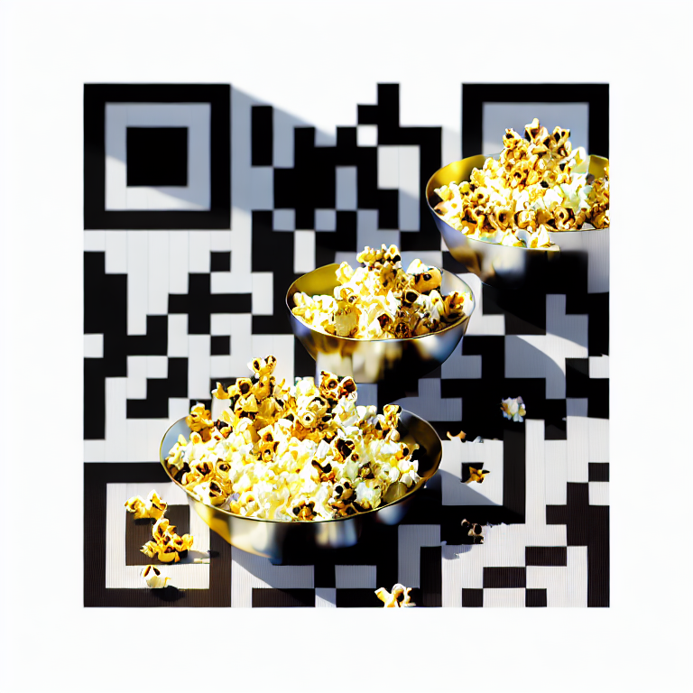

## Kodi QR codes

This resource add-on contains pre-rendered QR codes used in Kodi.

### Donation QR codes

The following QR codes link to `https://kodi.tv/donate/`.

They were generated using QR Craft with the following settings:

* **Prompt:** A bowl of popcorn, sunlight. very vibrant colors, soft lighting, adventurous, atmospheric lighting, 8 k, octane render. by makoto shinkai, stanley artgerm lau, wlop, rossdraws, james jean, andrei riabovitchev, marc simonetti, krenz cushart, sakimichan, d & d trending on artstation, digital art
* **Creativity Strength:** 1.00
* **Artistic Influence Level:** 10.0
* **QR Code Influence Weight:** 1.25

